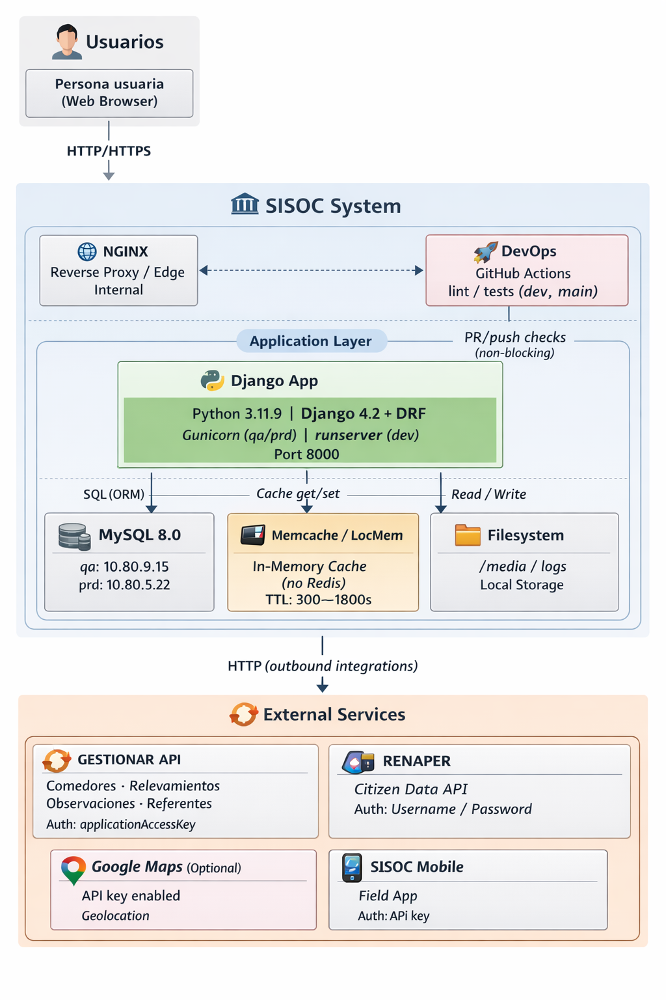

# SISOC — Infra Readme

> Estado: **Draft operativo**
>
> Alcance: infraestructura y operación (sin supuestos fuera de evidencia).

## Snapshot rápido

| Tema                     | Estado                                         |
| ------------------------ | ---------------------------------------------- |
| Branch de despliegue QA  | `development`                                  |
| Branch de despliegue PRD | `main`                                         |
| Hosting                  | Self-hosted + NGINX interno                    |
| Base de datos            | MySQL                                          |
| Cola asíncrona           | No Celery/Kafka (threads + ThreadPoolExecutor) |
| Secret manager           | No (operación actual con `.env`)          |

## 1. Purpose

- Backoffice Django para gestión de módulos sociales (comedores, relevamientos, ciudadanía, admisiones, centro de familia y otros).
- Centraliza operación interna web + API DRF con documentación OpenAPI.
- Integra con servicios externos para sincronización y validación de datos (GESTIONAR, RENAPER y SISOC Mobile).

- Casos de uso criticos:
  - Gestión de comedores y sincronización con GESTIONAR.
  - Registro de relevamientos y sincronización con GESTIONAR.
  - Operación de módulos de ciudadanía/admisiones/centro de familia.
  - Administración de usuarios, grupos y permisos internos.

## 2. Entornos

| Entorno | URL(s)                              | Hosting                     | Notas                                                                                     | Owner     |
| ----------- | ----------------------------------- | --------------------------- | ----------------------------------------------------------------------------------------- | --------- |
| qa          | http://10.80.9.15/                  | Self-hosted + NGINX interno | Deploy desde branch `development`; MySQL reportado en `10.80.9.15`                        | Tech Lead |
| prd         | https://sisoc.secretarianaf.gob.ar/ | Self-hosted + NGINX interno | Deploy desde branch `main`; host app reportado `10.80.5.45`; MySQL reportado `10.80.5.22` | Tech Lead |

## 3. Architecture (High-level)

- C4-style container list:
  - Cliente web (navegador).
  - NGINX interno (reverse proxy/edge interno).
  - Contenedor Django (Gunicorn en qa/prd, runserver en dev).
  - MySQL (persistencia principal).
  - Memcache/LocMem (cache en memoria de la aplicación).
  - Integraciones HTTP externas: GESTIONAR, RENAPER SISOC Mobile.

- C4 Container Diagram (Mermaid):

## 4. Networking / Edge

- Entry points (DNS/CDN/WAF/LB):
  - DNS público para prd: `sisoc.secretarianaf.gob.ar`.
  - CDN/WAF/LB: Desconocido, trabajo de infra.
  - Edge interno: NGINX.

- Puertos/protocolos de ingreso:
  - HTTP en qa y HTTPS en prd.
  - Pueto 8001 para Django

- Dependencias de egreso:
  - APIs GESTIONAR.
  - API RENAPER.
  - SISOC Mobile
  - Google Maps.

- Allowed origins/CORS (if applicable):
  - CORS permitido por lista derivada de `DJANGO_ALLOWED_HOSTS`.
  - Orígenes efectivos por entorno: https://api.appsheet.com, el dominio que se le de en un futuro a SISOC Mobile.

## 5. Compute / Runtime

- App runtime:
  - Python 3.11.9.
  - Django 4.2.x + DRF.
  - Gunicorn en qa/prd; runserver en dev.

- Process model:
  - Proceso web Django.
  - MySQL y Django definidos en compose local.
  - Jobs programados por cron del host (limpieza logs, prune Docker, hetrixtools, purge_auditlog).

- Autoscaling rules (if any):
  - UNKNOWN (no evidencia de autoscaling/orquestador en repo).

## 6. Data Stores

- Primary DB (engine, version if known):
  - MySQL 8.0 (principal).
  - Tests pueden usar SQLite in-memory.

- Cache (Memcached/Memcache):
  - Configuración Django: LocMemCache (cache en memoria local).
  - No se usa Redis.

- Object storage:
  - No evidencia de S3/MinIO.
  - Media en filesystem local del host/contenedor (reportado).

- Backups + retention + restore test status:
  - Gestión de backups a cargo de Infra.
  - Frecuencia/retención/último restore test: UNKNOWN.

## 7. Async / Queues / Schedulers

- Asincronismo:
  - No hay Celery/Kafka en arquitectura actual, la asincronía es con threading + ThreadPoolExecutor.

- Scheduled jobs (cron):
  - Limpieza diaria de logs.
  - Docker prune semanal.
  - Agente HetrixTools cada 5 minutos (para confirmar que el servicio no caiga).
  - Purga diaria de auditlog mayor a 180 días.

## 8. Integrations / Third parties

| Provider       | Purpose                                                            | Auth method                                 | Rate limits  | Failure mode                                                              | Notes                                   |
| -------------- | ------------------------------------------------------------------ | ------------------------------------------- | ------------ | ------------------------------------------------------------------------- | --------------------------------------- |
| GESTIONAR      | Sincronización de instancias | `applicationAccessKey` (header)             | 0      | Reintentos limitados/errores logueados | Endpoints por variables de entorno      |
| RENAPER        | Validación/consulta de datos ciudadanos                            | Usuario/contraseña por variables de entorno | UNKNOWN      | Timeout/error de API externa afecta validación                            | Configurado en settings/env             |
| Google Maps    | Funcionalidad geográfica opcional                                  | API key                                     | 0      | Degradación de features de mapas                                          | Clave opcional                         |
 SISOC Mobile    | Aplicacion de campo para SISOC                                  | API key                                     | 0      | Reintentos limitados/errores logueados                                          | Solo usuarios autenticados                          |

## 9. Deploy / Release / Rollback

- How deploys happen (CI/CD):
  - CI ejecuta lint/tests en PR/push (`development`/`main`).
  - Deploy a qa/prd es manual por Tech Lead.
  - Política de release documentada: flujo `development` → freeze/tag → validación QA → merge a `main` para prd.

- Migration strategy:
  - Migraciones Django en arranque del contenedor por entrypoint.
  - En dev puede ejecutar `makemigrations` automáticamente según flags.

- Rollback procedure:
  - Basado en último tag estable y backup de DB según checklist.

- Module toggles (if any):
  - Flags de runtime por entorno y seguridad (`ENVIRONMENT`, `DEBUG`, CSP, arranque/migraciones).

## 10. Observability

- Logs (where, format):
  - Logging central en archivos rotativos diarios por nivel (`info`/`error`/`warning`/`critical`) + `data.log` JSON.
  - Directorio por defecto `logs/` con fallback configurable.

- Metrics (where, key dashboards):
  - Dashboards/stack de métricas: UNKNOWN.

- Traces (if any):
  - Sentry para el trackeo de errores.

- Alerts (top alerts):
  - HetrixTools para errores en el server.
  - Sentry para errores de codigo.

## 11. Security / Compliance

- Secrets management:
  - Actual: variables de entorno vía archivo `.env` (sin secret manager activo).
  - Baseline recomienda migrar a secret manager en prod, se hara en un futuro.

- AuthN/AuthZ (SSO/OAuth/JWT):
  - Web: sesión Django.
  - API: TokenAuthentication + SessionAuthentication; permisos DRF por defecto autenticado.
  - API keys disponibles para integraciones.

- Least privilege / network policies:
  - Hardening de Django por entorno (HSTS/SSL redirect/cookies seguras/CSP).
  - Políticas de red formales (segmentación, SG/NACL, egress allowlist): Nada implementado.
